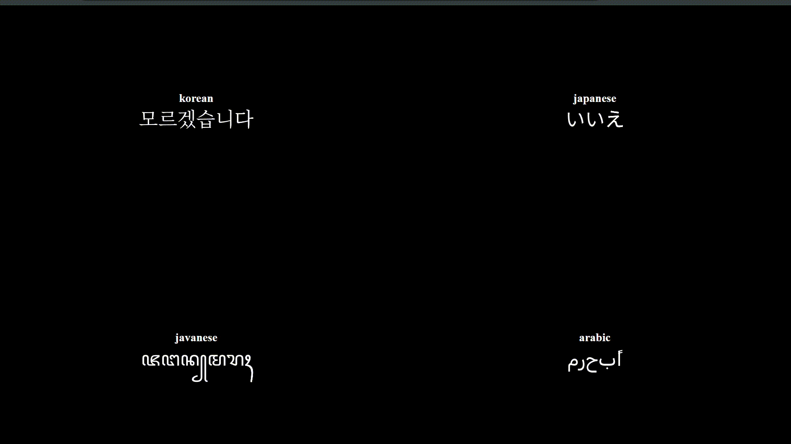

<p align="center">
  
</p>

# Henkei | へんけい
Henkei is a React animation component for transforming words through animation. It smoothly morphs each letter into the corresponding letter of the next word



## 📦 Installation

```bash
   pnpm add henkei
```

## 🐣 Usage
```tsx
import {Henkei} from 'henkei'

export default function App(){
  return (
    <div>
      <Henkei
        words={["Hello","World"]}
        interval={1000}
        duration={500}
        fontUrl="https://unpkg.com/@fontsource/chewy@5.0.8/files/chewy-latin-400-normal.woff"
        className='text-7xl font-chewy mb-2 tracking-wide text-left text-[#3D3522]'
      />
    </div>
  )
}
```

If you want the word to transform into a word that has an extreme form like words in Japanese, Chinese, Korean, etc. You have to find or download a font that supports this and put it in the `fontUrl` attribute. I recommend you to just download it to minimize the font not loading, you can download the font from [google font](https://fonts.google.com/) or from other sources. After you download it, you can put the file in the `public` folder or any folder you want and then in the `fontUrl` attribute you fill it with the `root relative path` (or absolute path starting from /) to the `.woff` or `.ttf` file. For example, let's assume you store it in the `public` folder:

```text
// public folder
public/
└── rubik.ttf  # the .ttf or .woff file you downloaded
```

Then, use it as follows:

```tsx
import {Henkei} from 'henkei'

export default function App() {
  return (
    <div>
      <Henkei
        words={["Hello", "World"]}
        interval={1000}
        duration={500}
        {/* set to the relative path to the file in the public/ folder */}
        fontUrl="/rubik.ttf"
        className='text-7xl font-chewy mb-2 tracking-wide text-left text-[#3D3522]'
      />
    </div>
  )
}

```

## 🛠️ API Reference

| Prop        | Type       | Default Value | Description |
| :---        | :---       | :---          | :---        |
| **`words`** | `string[]` | *(Required)*  | Array of strings containing the words to transition between. |
| **`interval`**| `number`   | `3000`        | Time in milliseconds between each word transition cycle. |
| **`duration`**| `number`   | `1000`        | The duration in milliseconds of the morphing animation itself. |
| **`className`**| `string`  | `undefined`   | Standard React class name applied to the outer wrapper element. |
| **`fontUrl`** | `string`   | `"https://unpkg.com/@fontsource/inter@5.0.19/files/inter-latin-400-normal.woff"` | URL to a valid `.ttf` or `.woff` font file containing the characters you want to render. |

## 🚀 Tech Stack

- [React](https://react.dev) - UI
- [Framer Motion](https://www.framer.com/motion/) - Animation
- [Opentype.js](https://opentype.js.org/) - Font path extraction
- [Flubber](https://github.com/veltman/flubber) - Smooth SVG polygon morphing
- [Polygon Clipping](https://github.com/mfogel/polygon-clipping) - Boolean operations (Union & Difference) for SVG paths


## 📜 License

[MIT](./LICENSE)